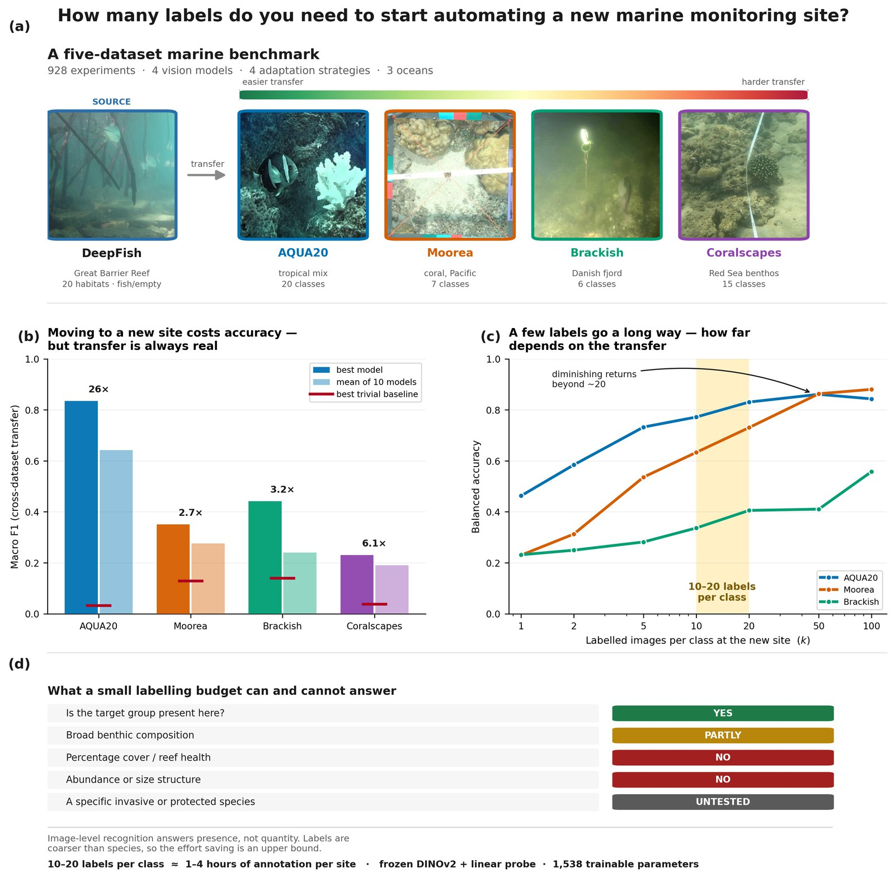

# How many labels do you need? A decision framework for cross-habitat marine biodiversity monitoring

Code for reproducing the experiments in:

> **How many labels do you need? A decision framework for cross-habitat marine biodiversity monitoring**
> Alzayat Saleh and Mostafa Rahimi Azghadi
> Under review

<p align="center">
  
</p>

<sub>Sample images are drawn from the five public datasets described below and are reproduced under their original licences.</sub>

## Overview

We evaluate whether vision foundation models (DINOv2, CLIP) can replace conventional CNNs for automated underwater image recognition across marine habitats, using five datasets spanning tropical reefs to temperate fjords. Three experimental protocols measure:

- **Protocol A** -- Within-habitat transfer (20 DeepFish reef habitats, 240 runs)
- **Protocol B** -- Cross-dataset transfer along a difficulty gradient (40 runs)
- **Protocol C** -- Few-shot adaptation curves, k = 0 to 100 labelled samples per class (648 runs)

**Key finding:** DINOv2 with a frozen linear probe (1,538 trainable parameters) matches or exceeds fully fine-tuned CNNs in every setting tested except the hardest cross-taxon transfer, where a fully fine-tuned ResNet-50 is marginally ahead. Approximately 10 to 20 labelled images per class suffice for reliable recognition at a new marine site, where the site presents an established label set under different imaging conditions.

<details>
<summary><b>Repository structure</b></summary>

```
.
├── configs/                    # YAML configuration files
│   ├── base_config.yaml        # Global settings (paths, seeds, hardware)
│   ├── models/                 # Model configs (DINOv2, CLIP, ResNet-50, EfficientNet-B4)
│   ├── adaptation/             # Adaptation strategy configs (LP, LoRA, VPT, FT)
│   └── experiments/            # Protocol-specific experiment configs
├── data/                       # Dataset loaders and preprocessing
│   ├── download_datasets.sh    # Download/verify all five datasets
│   ├── base_dataset.py         # Abstract base class for marine datasets
│   ├── deepfish_dataset.py     # DeepFish (20 habitats, GBR)
│   ├── aqua20_dataset.py       # AQUA20 (20 coarse marine categories)
│   ├── moorea_dataset.py       # Moorea Labeled Corals (9 benthic classes)
│   ├── coralscapes_dataset.py  # Coralscapes (14 benthic classes, Red Sea)
│   ├── brackish_dataset.py     # Brackish (6 coarse categories, temperate Denmark)
│   ├── fewshot_sampler.py      # k-shot support/query splitting
│   └── augmentations.py        # Train/test transforms
├── models/                     # Model definitions
│   ├── model_factory.py        # Unified model creation from config
│   ├── foundation_wrapper.py   # DINOv2 and CLIP wrappers
│   ├── baseline_models.py      # ResNet-50, EfficientNet-B4
│   ├── lora_adapter.py         # LoRA (rank-4) for ViT attention layers
│   ├── vpt_adapter.py          # Visual Prompt Tuning (VPT-Deep)
│   ├── classification_head.py  # Linear classification head
│   └── detection_head.py       # Detection head (unused in paper)
├── training/                   # Training and evaluation
│   ├── trainer.py              # Main training loop (AdamW, cosine LR, early stopping)
│   ├── evaluator.py            # Metrics: macro F1, balanced accuracy, per-class
│   ├── feature_cache.py        # Feature extraction and caching for linear probes
│   ├── early_stopping.py       # Patience-based early stopping
│   ├── losses.py               # Loss functions
│   └── optimizers.py           # Optimizer factory
├── experiments/                # Experiment runner scripts
│   ├── run_within_habitat.py   # Protocol A: leave-one-habitat-out
│   ├── run_cross_dataset.py    # Protocol B: cross-dataset transfer
│   ├── run_fewshot_curve.py    # Protocol C: few-shot adaptation curves
│   ├── run_all.sh              # Master script (all protocols)
│   └── run_protocol_*.sh       # Individual protocol scripts
├── analysis/                   # Post-hoc analysis
│   ├── extract_features.py     # Feature extraction for t-SNE
│   ├── tsne_visualization.py   # t-SNE projections
│   ├── compute_efficiency.py   # Parameter counts and training times
│   ├── protocol_b_baselines.py # Trivial baselines for Protocol B
│   ├── reeval_protocol_b.py    # Re-score Protocol B on a fixed label space
│   └── ...
├── figures/                    # Figure generation (Figs 1-12)
│   ├── generate_all_figures.py # Master figure script
│   ├── plot_utils.py           # Shared plotting utilities
│   ├── data_utils.py           # Data loading for figures
│   └── fig*.py                 # Individual figure scripts
├── utils/                      # Utilities
├── setup.py
├── requirements.txt
└── LICENSE
```

</details>

<details>
<summary><b>Setup: environment and datasets</b></summary>

All scripts read the dataset location from `data.root_dir` in
`configs/base_config.yaml`, which defaults to `./datasets`. If your data lives
elsewhere, symlink it rather than editing the config, so the tracked files stay
identical across machines:

```bash
ln -s /path/to/your/datasets datasets
```

`datasets/` is gitignored, so the symlink is never committed.

### 1. Environment

```bash
# Create conda environment
conda create -n cross-habitat python=3.10
conda activate cross-habitat

# Install PyTorch (adjust for your CUDA version)
conda install pytorch torchvision pytorch-cuda=12.1 -c pytorch -c nvidia

# Install dependencies
pip install -r requirements.txt

# Install package in development mode
pip install -e .
```

### 2. Datasets

Download all five datasets:

```bash
bash data/download_datasets.sh all ./datasets
```

This prints download instructions for each dataset. After downloading, your `datasets/` directory should contain:

| Dataset       | Directory                         | Source                                                                                              |
| ------------- | --------------------------------- | --------------------------------------------------------------------------------------------------- |
| DeepFish      | `datasets/DeepFish/`              | [alzayats/DeepFish](https://github.com/alzayats/DeepFish)                                           |
| AQUA20        | `datasets/AQUA20_dataset/`        | [Kaggle](https://www.kaggle.com/datasets/slavkoprytula/aquarium-data-cots)                          |
| Moorea Corals | `datasets/Moorea_Labeled_Corals/` | [EDI Repository](https://portal.edirepository.org/nis/mapbrowse?scope=knb-lter-mcr&identifier=5006) |
| Coralscapes   | `datasets/Coralscapes_dataset/`   | [HuggingFace](https://huggingface.co/datasets/EPFL-ECEO/coralscapes)                                |
| Brackish      | `datasets/Brackish_dataset/`      | [Kaggle](https://www.kaggle.com/datasets/aalborguniversity/brackish-dataset)                        |

Update `configs/base_config.yaml` if you use a different dataset path:

```yaml
data:
  root_dir: "./datasets"  # Change to your path
```

</details>

<details>
<summary><b>Running the experiments</b></summary>

### Quick Start -- Single Run

```bash
# Protocol A: single model + habitat
python -m experiments.run_within_habitat \
    --model dinov2_base --adaptation linear_probe \
    --all --seed 42

# Protocol B: single transfer pair
python -m experiments.run_cross_dataset \
    --model dinov2_base --adaptation linear_probe \
    --source deepfish --target aqua20 \
    --strategy open_set --seed 42

# Protocol C: single few-shot curve
python -m experiments.run_fewshot_curve \
    --model dinov2_base --adaptation linear_probe \
    --source deepfish --target aqua20 \
    --strategy combined --seed 42
```

### Full Reproduction

Run all experiments as described in the paper (~730 GPU hours on a single RTX 4090):

```bash
# All protocols (Protocol A + B + C + analysis + figures)
bash experiments/run_all.sh reduced

# Or run protocols individually:
bash experiments/run_all.sh A    # Protocol A only (~200 runs)
bash experiments/run_all.sh B    # Protocol B only (~40 runs)
bash experiments/run_all.sh C    # Protocol C only (~648 runs)
```

### Generate Figures

After experiments complete:

```bash
python -m figures.generate_all_figures
```

Figures are saved to `outputs/figures/` as PDF and PNG.

### Protocol B baselines and re-evaluation

Protocol B builds class prototypes from the target training split and scores them
against the target test split. Both splits must share one label space; where they hold
different class sets, per-split integer mappings do not correspond. `align_label_spaces`
in `experiments/run_cross_dataset.py` enforces this.

To re-score already-trained runs on the corrected label space, without retraining:

```bash
python -m analysis.reeval_protocol_b                    # affected targets
python -m analysis.reeval_protocol_b --targets brackish # control: expect no change
```

Results are written to `results_fixed.json` beside each run's `results.json`.

To report uniform-random and majority-class baselines over an explicit fixed label set:

```bash
python -m analysis.protocol_b_baselines --recompute
```

Note that `sklearn`'s macro F1 averages over the union of classes present in `y_true`
and `y_pred` unless an explicit `labels` argument is given, so the denominator varies
between runs. Both scripts pass `labels` explicitly.

</details>

<details>
<summary><b>Model and adaptation configurations</b></summary>

| Model           | Adaptation     | Trainable Params | Protocol A F1 |
| --------------- | -------------- | ---------------- | ------------- |
| DINOv2-B        | Linear Probe   | 1,538            | 0.70 +/- 0.28 |
| DINOv2-B        | LoRA (r=4)     | 149K             | 0.64 +/- 0.30 |
| DINOv2-B        | VPT-Deep       | 94K              | 0.65 +/- 0.30 |
| CLIP-B          | Linear Probe   | 1,027            | 0.60 +/- 0.23 |
| CLIP-B          | LoRA (r=4)     | 75K              | 0.58 +/- 0.23 |
| CLIP-B          | VPT-Deep       | 93K              | 0.59 +/- 0.23 |
| ResNet-50       | Linear Probe   | 4,098            | 0.56 +/- 0.23 |
| ResNet-50       | Full Fine-tune | 23.5M            | 0.63 +/- 0.27 |
| EfficientNet-B4 | Linear Probe   | 3,586            | 0.57 +/- 0.22 |
| EfficientNet-B4 | Full Fine-tune | 17.6M            | 0.67 +/- 0.24 |

</details>

<details>
<summary><b>Hardware requirements</b></summary>

- **Minimum:** 16 GB GPU (for linear probes and LoRA)
- **Recommended:** 24 GB GPU (for full fine-tuning of EfficientNet-B4)
- **Tested on:** NVIDIA RTX 4090 (24 GB)

Linear probe training completes in ~5 minutes per run. LoRA training takes ~40 minutes. Full fine-tuning takes ~15 minutes for CNNs.

</details>

## Citation

```bibtex
@article{saleh2026crosshabitat,
  title={How many labels do you need? A decision framework for cross-habitat marine biodiversity monitoring},
  author={Saleh, Alzayat and Rahimi Azghadi, Mostafa},
  year={2026},
  note={Under review}
}
```

## License

MIT License. See [LICENSE](LICENSE) for details.
